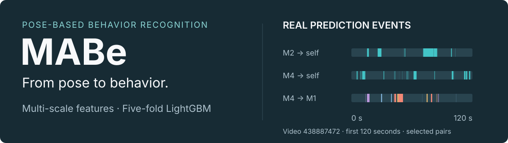
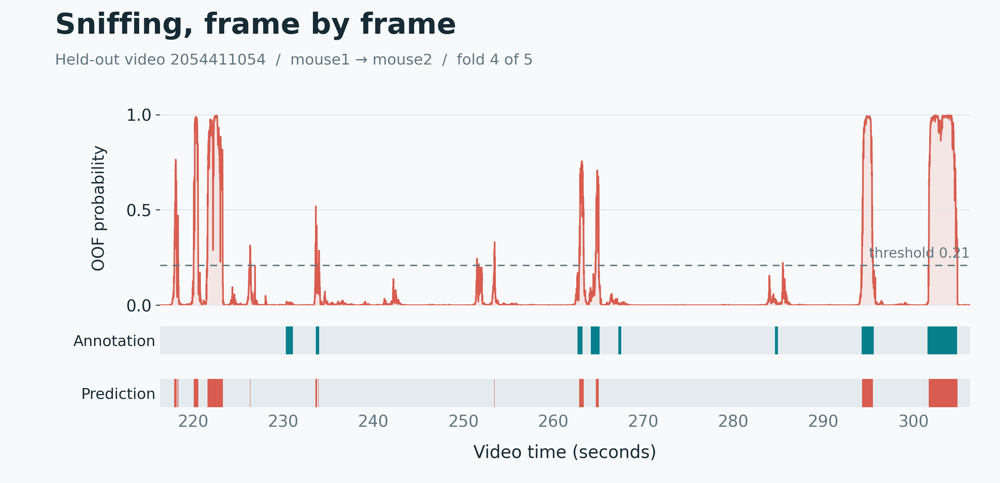
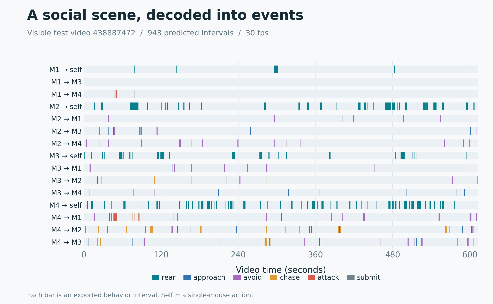

# MABe · Mouse Behavior Recognition

[简体中文](README.md) · **English**

<p align="center">
  
</p>

**Identify who does what to whom, and when, from pose trajectories.** This project combines head–body motion decomposition, directed interaction features, and multi-scale temporal context to recognize mouse behavior across frame rates, spatial scales, and keypoint configurations. Five-fold LightGBM models produce frame-level predictions that are decoded into behavior events.

The complete pipeline covers **36 behaviors, 9 keypoint configurations, and 84 behavior tasks**, from feature design and model training to behavior-specific thresholds, resumable training, and offline inference.

[Method and Key Contributions](#method-and-key-contributions) · [Experiments](#experiments) · [Prediction Visualizations](#prediction-visualizations) · [Quick Start](#quick-start) · [Training and Inference](#training-and-inference)

## Method and Key Contributions

The central idea is to organize keypoint geometry into behavior-oriented representations: **decompose individual motion, preserve interaction direction, align temporal scales, and learn a decision boundary for each behavior.**

<p align="center">
  <strong>Pose trajectories + video metadata</strong><br>
  ↓<br>
  Physical-scale alignment · Bounded gap filling + missingness<br>
  ↓<br>
  Head–body motion · Directed interactions · Temporal context<br>
  ↓<br>
  Models per configuration and behavior · Video-grouped five-fold LightGBM<br>
  ↓<br>
  Fold averaging · Behavior competition · Behavior thresholds<br>
  ↓<br>
  <strong>Agent · Target · Behavior · Start / Stop frames</strong>
</p>

### 1. Head–body motion decomposition

Similar body-center displacements can accompany different local actions. The feature representation separates nose motion relative to the body center from whole-body translation, then projects body-center velocity onto the body axis. This exposes head activity, forward/backward movement, and lateral motion to the classifier.

| Representation | Construction | Behavioral information |
| --- | --- | --- |
| Relative head motion | Temporal differences of nose-to-center position; relative head speed divided by body speed | Local head activity in relation to body translation |
| Body-axis motion | Velocity projected onto the tail-to-head axis and its normal | Forward, backward, and lateral movement; motion–orientation mismatch |
| Posture and micromotion | Head turning rate, body shape, trajectory curvature, short-window speed and acceleration statistics | Posture changes and short-duration motion structure |

Multi-scale means, standard deviations, and state occupancy features describe both instantaneous movement and its persistence.

### 2. Directed interaction and contact features

Social behaviors are modeled for an ordered **agent A → target B** pair. Beyond inter-mouse distance, the representation includes approach/separation rate, orientation alignment, motion correlation, and leader–follower asymmetry to describe interaction dynamics.

Contact features distinguish **A's front anchor relative to B's nose, body, and tail**. Distance thresholds of 3, 5, and 8 cm define contact indicators and their occupancy within temporal windows. Corresponding features are computed with A and B exchanged, retaining contact location, direction, and duration for behavior classification.

### 3. Physical scale and temporal context

Coordinates are converted using each video's pixels-per-centimeter scale, and temporal windows are adjusted to its frame rate. For example, reference windows of 15, 30, 60, and 120 frames at 30 fps correspond to 0.5, 1, 2, and 4 seconds. Feature groups use appropriate subsets of these scales and longer temporal contexts.

Bounded interpolation and forward/backward filling are combined with missing-keypoint ratios, visibility indicators, and missingness streak lengths. Features are organized by available keypoint configuration and augmented with video metadata, providing both behavior descriptors and acquisition context. Temporal features use past and future frames for offline video analysis.

### 4. Behavior-specific decisions and event decoding

A binary classifier is trained for each combination of keypoint configuration, single-mouse/pair type, and behavior. `StratifiedGroupKFold(n_splits=5)` groups frames by video, keeping every frame from one video in the same fold. Out-of-fold (OOF) predictions are used to select an F1 threshold for each task.

At inference, probabilities are averaged across five folds. The highest-probability candidate behavior is selected and filtered by its own threshold. Consecutive predictions of the same behavior are merged into intervals, with frame-number gaps creating separate segments. The output is an **agent–target–behavior–time interval** representation.

**Resource-aware training.** Features are written to a size-limited Parquet cache and accessed through LightGBM Sequence. Fold checkpoints support pausing and resuming at task, time, and output-space budgets. This workflow trained all **420 fold models** while reusing completed folds across sessions.

## Experiments

### Hidden-test evaluation

The full recognition and event-decoding pipeline is evaluated on the MABe Challenge hidden test set using the official **MABe F Beta** metric.

| Kaggle Public | Kaggle Private |
| :---: | :---: |
| **0.49911** | **0.48777** |

### Video-grouped five-fold validation

The experiments cover 11 individual behaviors and 25 pairwise social behaviors. For each task, predictions from all five held-out folds are concatenated to recompute binary F1. The table aggregates tasks with equal weight. Thresholds are selected on these same OOF predictions; hidden-test evaluation uses the independent official metric above.

| Task type | Behaviors | Tasks | Features per task | Mean OOF F1 | Median OOF F1 |
| --- | :---: | :---: | :---: | :---: | :---: |
| Individual | 11 | 21 | 345–418 | 0.4826 | 0.5363 |
| Pairwise | 25 | 63 | 183–399 | 0.5058 | 0.5488 |
| **All tasks** | **36** | **84** | **183–418** | **0.5000** | **0.5426** |

This protocol separates model fitting and validation at the video level and reports individual and social behavior recognition separately. Saved F1 values match the recomputed OOF scores for all 84 tasks.

<details>
<summary>Model configuration</summary>

| Parameter | Setting |
| --- | --- |
| Model | LightGBM binary classifier |
| Cross-validation | 5 folds, grouped by video |
| Trees / learning rate | 250 / 0.08 |
| Maximum depth / leaves | 6 / 31 |
| Row / feature sampling | 0.8 / 0.8 |
| L1 / L2 regularization | 0.1 / 0.1 |
| Threshold optimization | 100 trials per task, maximizing OOF F1 |

</details>

## Prediction Visualizations

### From frame-level probabilities to behavior intervals

The example below shows `sniff` behavior for `mouse1 → mouse2` in a held-out video. The upper panel plots raw OOF probabilities and the decision threshold. The lower panels compare annotations with predicted intervals, showing the model's response to behavior onset, duration, and offset.



The figure covers a 90-second segment from fold 4, with a threshold of 0.21. It shows the binary decision for one behavior; full inference also applies competition between candidate behaviors.

### A timeline of multi-mouse interactions

For the visible test video, the model converts the individual actions and directed interactions of four mice into **943 behavior events**. Each row represents an agent–target combination, and each colored bar is a predicted interval, exposing the temporal distribution of behaviors throughout the video.



The figure can be regenerated directly from the included [prediction CSV](examples/predicted-events.csv). Replaying the visible test data through the repository's inference entry point reproduced all 943 predictions in a byte-identical output file.

## Quick Start

Generate a timeline from real predictions without downloading models or competition data:

```bash
git clone https://github.com/Jim-jimu/mabe-behavior-recognition.git
cd mabe-behavior-recognition
python3.12 -m venv .venv
source .venv/bin/activate
python -m pip install -r requirements-viz.txt
python scripts/visualize_predictions.py
```

The figure is saved to `outputs/figures/prediction-timeline.png`. To train models and generate new predictions, use the workflow below.

## Training and Inference

### Environment and data

```bash
python -m pip install -r requirements.txt
```

The environment uses **Python 3.12, LightGBM 4.6.0, scikit-learn 1.8.0, and NumPy 1.26.4**, with CPU training and inference. On macOS, run `brew install libomp` if the OpenMP library is missing.

Download the data from the [Kaggle competition data page](https://www.kaggle.com/competitions/MABe-mouse-behavior-detection/data) and arrange it as follows:

```text
data/mabe/
├── train.csv
├── test.csv
├── train_tracking/<lab_id>/<video_id>.parquet
├── train_annotation/<lab_id>/<video_id>.parquet
└── test_tracking/<lab_id>/<video_id>.parquet
```

### Training

```bash
MABE_DATA_DIR="$PWD/data/mabe" \
MABE_OUTPUT_BASE="$PWD/outputs/run-01" \
MABE_CACHE_DIR="$PWD/outputs/scratch" \
python src/train_fold555_disk_safe.py
```

By default, each run trains up to 3 new tasks, with a 4 GiB feature cache and a 6 GiB output budget. The final `OUTPUT` log entry points to the run's `fold555` checkpoint directory.

<details>
<summary>Resuming training and resource settings</summary>

If `run_status.json` reports `paused`, keep the run's artifacts, supply them as the resume source, and use a new output directory:

```bash
MABE_DATA_DIR="$PWD/data/mabe" \
MABE_RESUME_DIR="/absolute/path/to/previous/fold555" \
MABE_OUTPUT_BASE="$PWD/outputs/run-02" \
MABE_CACHE_DIR="$PWD/outputs/scratch" \
python src/train_fold555_disk_safe.py
```

Repeat until `run_status.json` reports `complete`. Each output includes previously completed models. Once the new run's output is complete, older runs can be archived to reclaim space.

| Environment variable | Default | Purpose |
| --- | --- | --- |
| `MABE_MODEL_JOBS` | `-1` | Use the CPU threads available to the environment |
| `MABE_MAX_NEW_TASKS` | `3` | New tasks per run; `0` removes the limit |
| `MABE_MAX_HOURS` | `3` | Soft time budget, checked at checkpoint boundaries |
| `MABE_CACHE_GB` | `4` | Feature cache budget on disk |
| `MABE_OUTPUT_GB` | `6` | Space budget for the current output directory tree |

With sufficient disk space and runtime, set `MABE_MAX_NEW_TASKS=0 MABE_MAX_HOURS=0` to remove task and soft time limits. Feature generation is sequential by default; model fitting uses multiple threads.

A complete checkpoint contains models, thresholds, feature columns, metadata vocabularies, keypoint configurations, and OOF predictions. Resuming automatically checks data fingerprints, feature definitions, dependency versions, and file integrity.

</details>

### Inference

```bash
python src/submit_fold555.py \
  --checkpoint /absolute/path/to/fold555 \
  --data data/mabe \
  --output outputs/inference \
  --threads 4
```

This produces `submission.csv` and `submission-report.json`. Each prediction contains:

```text
row_id,video_id,agent_id,target_id,action,start_frame,stop_frame
```

<details>
<summary>Recompute OOF results and regenerate the annotation comparison</summary>

Check every model, recompute OOF scores, and retain frame-level probabilities:

```bash
python src/infer_fold555.py \
  --checkpoint /absolute/path/to/fold555 \
  --data data/mabe \
  --output outputs/verification \
  --threads 4 --audit-oof
```

Generate the `sniff` comparison shown above:

```bash
python scripts/visualize_predictions.py \
  --oof /absolute/path/to/fold555/9/sniff/oof_predictions.parquet \
  --metadata data/mabe/train.csv \
  --output outputs/figures
```

</details>

## Repository Layout

```text
src/             LightGBM training, checkpoint recovery, and inference
scripts/         Prediction visualizations
tests/           Interval decoding, checkpoint recovery, and resource-budget tests
evidence/        Experiment data and verification records
examples/        Predictions ready for visualization
assets/readme/   Figures and source provenance
code/            XGBoost experiments
```

Run checks with `python -m unittest discover -s tests -v`. Model weights and raw data are stored outside the repository; use the workflow above to train your own checkpoints. Dependencies for the XGBoost experiments in `code/` are listed in [code/requirements-xgboost.txt](code/requirements-xgboost.txt).

Data and evaluation: [MABe Challenge](https://www.kaggle.com/competitions/MABe-mouse-behavior-detection) · [Official MABe F Beta metric](https://www.kaggle.com/code/metric/mabe-f-beta).
