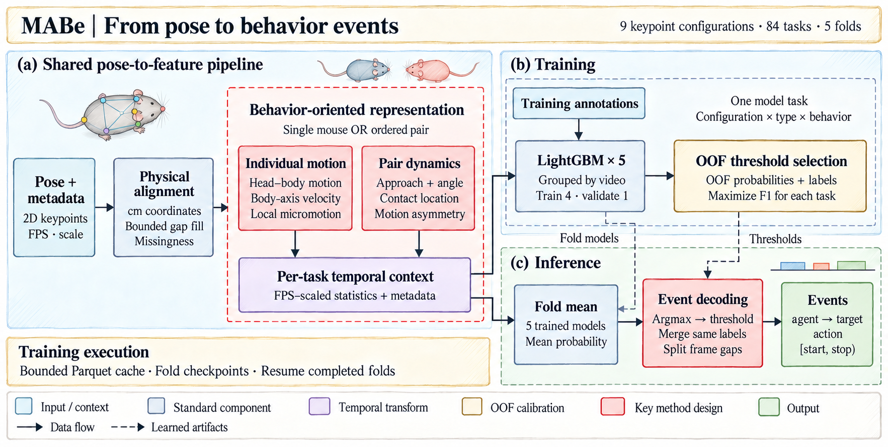

# MABe · 小鼠行为识别

**简体中文** · [English](README.en.md)

<p align="center">
  
</p>

**从姿态轨迹中识别“谁对谁做了什么”，并定位行为的起止时间。** 本项目面向不同帧率、空间尺度和关键点配置下的小鼠行为分析，将头身运动分解、有向交互关系和多尺度时间上下文结合起来，以五折 LightGBM 完成逐帧识别与事件解码。

完整方案覆盖 **36 类行为、9 种关键点配置、84 个行为任务**，包括特征设计、模型训练、行为阈值优化、可恢复训练与离线推理。

[方法设计与创新点](#方法设计与创新点) · [实验结果](#实验结果) · [预测可视化](#预测可视化) · [快速体验](#快速体验) · [训练与推理](#训练与推理)

## 方法设计与创新点

核心思路是把关键点的几何变化组织成具有行为含义的表示：**分解个体运动、刻画交互方向、统一时间尺度，再按行为学习决策边界。**

<p align="center">
  <a href="assets/readme/method-framework.png">
    
  </a>
</p>

### 1. 头身运动解耦：描述动作如何发生

相似的体心位移可以对应不同的局部动作。特征设计将鼻部相对体心的运动与整体移动分开，并将体心速度投影到身体朝向上，使模型能够同时观察头部活动、前进/后退和侧向运动。

| 表示 | 构造方式 | 行为信息 |
| --- | --- | --- |
| 头身相对运动 | 鼻部相对体心的位置差分、相对速度与体心速度之比 | 局部头部活动与整体位移的关系 |
| 身体轴向运动 | 速度在尾部至头部方向及其法向上的投影 | 前进、后退、侧移及运动与朝向的偏离 |
| 姿态与微动 | 头部转速、身体形状、轨迹曲率、短时速度与加速度统计 | 姿态变化和短时动作结构 |

这些表示与多尺度均值、标准差和状态占比共同输入模型，保留瞬时动作及其持续性。

### 2. 有向交互建模：描述谁在主动接近谁

社交行为以 **施动者 A → 目标 B** 为单位建模。除鼠间距离外，特征还编码接近/远离速度、朝向一致性、运动相关性和领导—跟随不对称性，表达两只鼠之间的动态关系。

接触表示进一步区分 **A 的前端到 B 的鼻部、身体和尾部**，在 3、5、8 cm 距离尺度上计算接触指示及时间窗口内的接触占比。互换 A、B 后分别计算相应特征，让接触位置、交互方向和持续时间共同参与行为判别。

### 3. 物理尺度与时间上下文统一

坐标按视频的像素/厘米比例转换，时间窗口按实际帧率缩放。例如，以 30 fps 为基准的 15、30、60、120 帧窗口对应 0.5、1、2、4 秒；各特征组按需要选用这些尺度及更长时间上下文。

缺失处理结合有界插值、前后填充与缺失比例、关键点可见性、连续缺失长度特征。不同关键点配置分别组织特征，并结合视频元数据编码，使模型同时获得行为描述与采集条件信息。时间上下文使用前后帧，面向离线视频分析。

### 4. 行为自适应决策与事件解码

按“关键点配置 × 个体/双鼠类型 × 行为”训练二分类器。使用 `StratifiedGroupKFold(n_splits=5)` 按视频分组，同一视频的帧保持在同一折；通过折外预测（OOF）为每个任务选择 F1 阈值。

推理先对五折概率求平均，再在当前候选行为中选择最大概率行为，并应用对应阈值。连续同类预测合并为起止帧区间，遇到帧号断点则分段，得到可直接分析的 **施动者—目标—行为—时间区间**。

**支撑完整训练的资源设计。** 特征写入有容量上限的 Parquet 缓存，由 LightGBM Sequence 读取；每折保存检查点，按任务数、时间与输出空间预算暂停和恢复。该流程完成了全部 **420 个折模型** 的训练，并支持跨会话复用已完成的折。

## 实验结果

### 隐藏测试集评测

在 MABe Challenge 的隐藏测试集上，采用官方 **MABe F Beta** 指标评估完整的行为识别与事件解码流程。

| Kaggle Public | Kaggle Private |
| :---: | :---: |
| **0.49911** | **0.48777** |

### 视频分组五折验证

实验覆盖 11 类个体行为和 25 类双鼠交互行为。每个任务拼接五折留出预测，复算任务级二分类 F1；下表对任务等权汇总。阈值由同一套 OOF 预测选择，隐藏测试集按上表官方指标独立评估。

| 任务类型 | 行为类别 | 任务数 | 每任务特征数 | 平均 OOF F1 | 中位 OOF F1 |
| --- | :---: | :---: | :---: | :---: | :---: |
| 个体行为 | 11 | 21 | 345–418 | 0.4826 | 0.5363 |
| 双鼠交互 | 25 | 63 | 183–399 | 0.5058 | 0.5488 |
| **全部任务** | **36** | **84** | **183–418** | **0.5000** | **0.5426** |

该设置在视频层面分离模型拟合与验证，同时分别观察个体动作和双鼠交互的识别表现。84 个任务保存的 F1 均与 OOF 预测复算结果一致。

<details>
<summary>模型配置</summary>

| 参数 | 设置 |
| --- | --- |
| 模型 | LightGBM 二分类器 |
| 交叉验证 | 视频分组，5 折 |
| 树数量 / 学习率 | 250 / 0.08 |
| 最大深度 / 叶子数 | 6 / 31 |
| 行采样 / 特征采样 | 0.8 / 0.8 |
| L1 / L2 正则化 | 0.1 / 0.1 |
| 阈值优化 | 每任务 100 次搜索，目标为 OOF F1 |

</details>

## 预测可视化

### 从逐帧概率到行为区间

下图展示一个留出视频中 `mouse1 → mouse2` 的 `sniff` 行为。上方为原始 OOF 概率与决策阈值，下方对照真实标注和预测区间，可以观察模型对动作出现、持续和结束的响应。


图中为第 4 折的 90 秒片段，阈值为 0.21；展示的是单行为二分类决策，完整推理再加入多行为竞争。

### 多鼠交互的完整时间轴

在可见测试视频中，模型将 4 只小鼠的个体动作与有向交互转换为 **943 段行为事件**。每行对应一个施动者与目标组合，每个色块对应一个预测区间，呈现行为在整段视频中的分布。


时间轴可由仓库中的[预测事件 CSV](examples/predicted-events.csv)直接重绘。使用仓库推理入口重放可见测试数据，生成的 943 条预测与已验证的输出文件逐字节一致。

## 快速体验

无需下载数据或模型，即可用真实预测结果生成时间轴：

```bash
git clone https://github.com/Jim-jimu/mabe-behavior-recognition.git
cd mabe-behavior-recognition
python3.12 -m venv .venv
source .venv/bin/activate
python -m pip install -r requirements-viz.txt
python scripts/visualize_predictions.py
```

结果保存在 `outputs/figures/prediction-timeline.png`。训练模型和生成新预测见下文。

## 训练与推理

### 准备环境与数据

```bash
python -m pip install -r requirements.txt
```

运行环境为 **Python 3.12、LightGBM 4.6.0、scikit-learn 1.8.0、NumPy 1.26.4**，使用 CPU 训练与推理。macOS 若提示缺少 `libomp`，先执行 `brew install libomp`。

从 [Kaggle 竞赛数据页](https://www.kaggle.com/competitions/MABe-mouse-behavior-detection/data)获取数据，目录结构如下：

```text
data/mabe/
├── train.csv
├── test.csv
├── train_tracking/<lab_id>/<video_id>.parquet
├── train_annotation/<lab_id>/<video_id>.parquet
└── test_tracking/<lab_id>/<video_id>.parquet
```

### 训练

```bash
MABE_DATA_DIR="$PWD/data/mabe" \
MABE_OUTPUT_BASE="$PWD/outputs/run-01" \
MABE_CACHE_DIR="$PWD/outputs/scratch" \
python src/train_fold555_disk_safe.py
```

每轮默认最多训练 3 个新任务，采用 4 GiB 特征缓存和 6 GiB 输出预算。日志末尾的 `OUTPUT` 指向本轮 `fold555` 检查点目录。

<details>
<summary>续训与资源配置</summary>

若 `run_status.json` 为 `paused`，保留本轮产物，将其作为续训来源，并指定新的输出目录：

```bash
MABE_DATA_DIR="$PWD/data/mabe" \
MABE_RESUME_DIR="/absolute/path/to/previous/fold555" \
MABE_OUTPUT_BASE="$PWD/outputs/run-02" \
MABE_CACHE_DIR="$PWD/outputs/scratch" \
python src/train_fold555_disk_safe.py
```

重复至 `run_status.json` 为 `complete`。每轮输出携带之前已完成的模型；确认新一轮保存完整后，可归档旧轮次释放空间。

| 环境变量 | 默认值 | 作用 |
| --- | --- | --- |
| `MABE_MODEL_JOBS` | `-1` | 使用环境可用 CPU 线程 |
| `MABE_MAX_NEW_TASKS` | `3` | 每轮新增任务上限，`0` 为不限 |
| `MABE_MAX_HOURS` | `3` | 软时间预算，在检查点边界暂停 |
| `MABE_CACHE_GB` | `4` | 特征磁盘缓存预算 |
| `MABE_OUTPUT_GB` | `6` | 当前输出目录树的空间预算 |

磁盘和时间充足时，设置 `MABE_MAX_NEW_TASKS=0 MABE_MAX_HOURS=0` 可取消分批与软时间限制。特征生成默认串行，模型拟合使用多线程。

完整检查点包含模型、阈值、特征列、元数据词表、关键点配置和 OOF 预测。恢复时自动校验数据指纹、特征定义、依赖版本与文件完整性。

</details>

### 推理

```bash
python src/submit_fold555.py \
  --checkpoint /absolute/path/to/fold555 \
  --data data/mabe \
  --output outputs/inference \
  --threads 4
```

输出 `submission.csv` 和 `submission-report.json`。每条预测包含：

```text
row_id,video_id,agent_id,target_id,action,start_frame,stop_frame
```

<details>
<summary>复核 OOF 结果与重绘标注对照图</summary>

检查全部模型、复算 OOF 分数并保留逐帧预测概率：

```bash
python src/infer_fold555.py \
  --checkpoint /absolute/path/to/fold555 \
  --data data/mabe \
  --output outputs/verification \
  --threads 4 --audit-oof
```

生成上文的 `sniff` 行为对照图：

```bash
python scripts/visualize_predictions.py \
  --oof /absolute/path/to/fold555/9/sniff/oof_predictions.parquet \
  --metadata data/mabe/train.csv \
  --output outputs/figures
```

</details>

## 项目结构

```text
src/             LightGBM 训练、续训与推理
scripts/         预测可视化
tests/           区间解码、检查点恢复与资源预算测试
evidence/        实验数据与复核记录
examples/        可直接重绘的预测事件
assets/readme/   展示图及其来源信息
code/            XGBoost 实验代码
```

运行检查：`python -m unittest discover -s tests -v`。模型权重和原始数据存放在仓库外，可按上述流程训练自己的检查点。`code/` 中的 XGBoost 实验依赖见 [code/requirements-xgboost.txt](code/requirements-xgboost.txt)。

数据与评测：[MABe Challenge](https://www.kaggle.com/competitions/MABe-mouse-behavior-detection) · [官方 MABe F Beta 指标](https://www.kaggle.com/code/metric/mabe-f-beta)。
